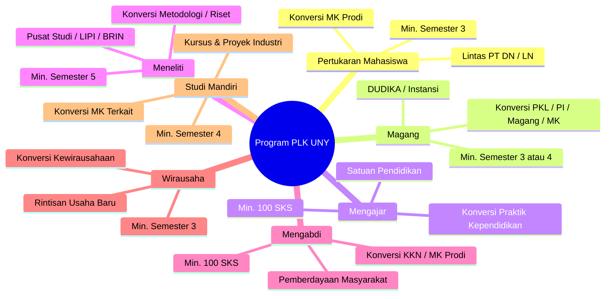
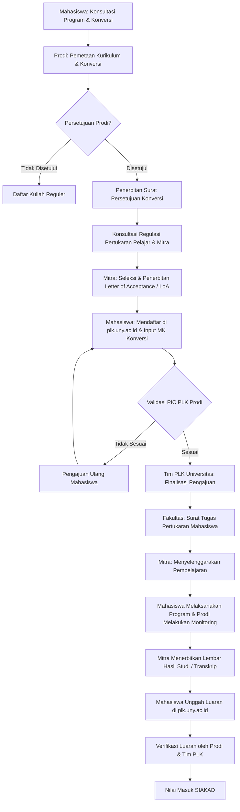
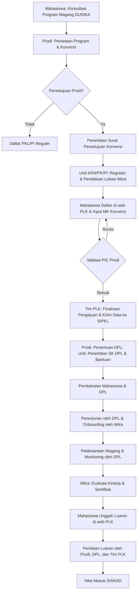
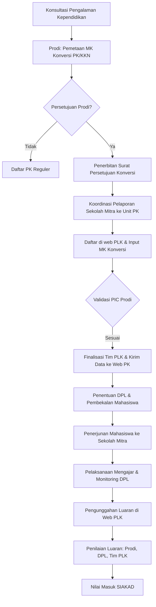
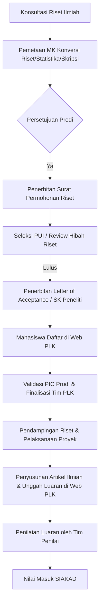
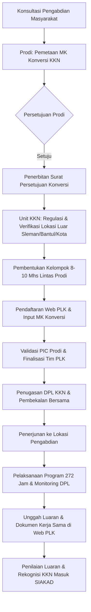
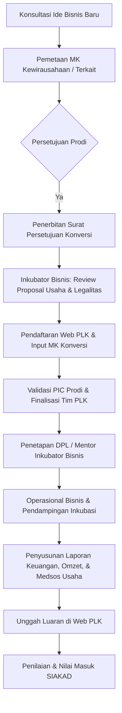
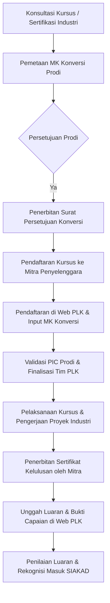

---
tags: [panduan, plk, uny, resmi]
created: 2026-09-28
status: active
sumber: Buku Panduan PLK UNY 2025
---

# Panduan Pembelajaran Luar Kampus (PLK) Universitas Negeri Yogyakarta 2025

> **Sumber Dokumen**: Buku Panduan Pembelajaran Luar Kampus (PLK) Edisi Tahun 2025 — Universitas Negeri Yogyakarta  
> **Kanal Resmi**: Website: [uny.ac.id](https://www.uny.ac.id) | [plk.uny.ac.id](https://plk.uny.ac.id) | Instagram: [@plk_uny](https://instagram.com/plk_uny)

---

## Daftar Isi
- [Kata Pengantar](#kata-pengantar)
- [BAB I: Pendahuluan](#bab-i-pendahuluan)
  - [A. Latar Belakang](#a-latar-belakang)
  - [B. Landasan Hukum](#b-landasan-hukum)
  - [C. Tujuan Program PLK](#c-tujuan-program-plk)
  - [D. Keunggulan dan Manfaat Program PLK](#d-keunggulan-dan-manfaat-program-plk)
  - [E. Persyaratan Mahasiswa & Konversi](#e-persyaratan-mahasiswa--konversi)
- [BAB II: Pihak Terkait & Perannya](#bab-ii-pihak-terkait--perannya)
  - [1. Internal Universitas](#1-internal-universitas)
  - [2. Mitra Eksternal](#2-mitra-eksternal)
- [BAB III: Bentuk Kegiatan PLK (7 Program Utama)](#bab-iii-bentuk-kegiatan-plk-7-program-utama)
  - [A. UNY Pertukaran Mahasiswa](#a-uny-pertukaran-mahasiswa)
  - [B. UNY Magang](#b-uny-magang)
  - [C. UNY Mengajar](#c-uny-mengajar)
  - [D. UNY Meneliti](#d-uny-meneliti)
  - [E. UNY Mengabdi](#e-uny-mengabdi)
  - [F. UNY Wirausaha](#f-uny-wirausaha)
  - [G. UNY Studi Mandiri](#g-uny-studi-mandiri)
- [BAB IV: Penutup](#bab-iv-penutup)
- [Lampiran](#lampiran)
  - [Lampiran 1: Template Surat Persetujuan Prodi](#lampiran-1-template-surat-persetujuan-prodi)
  - [Lampiran 2: Template Sampul Laporan PLK](#lampiran-2-template-sampul-laporan-plk)
  - [Lampiran 3: Template Pengesahan Laporan PLK](#lampiran-3-template-pengesahan-laporan-plk)
  - [Lampiran 4: Template Abstrak & Prakata Laporan PLK](#lampiran-4-template-abstrak--prakata-laporan-plk)
  - [Lampiran 5: Struktur Laporan Akhir PLK](#lampiran-5-struktur-laporan-akhir-plk)

---

## Kata Pengantar
Program Pembelajaran Luar Kampus (PLK) merupakan pengembangan Merdeka Belajar - Kampus Merdeka (MBKM) yang dikelola secara mandiri oleh Universitas Negeri Yogyakarta (UNY) bersama mitra. Program ini memberikan fleksibilitas pengakuan/konversi kegiatan ke dalam Sistem Kredit Semester (SKS) maksimal hingga 20 SKS, memungkinkan mahasiswa menyelesaikan studi lebih cepat sekaligus memperoleh pengalaman praktis yang relevan di dunia kerja.

---

## BAB I: Pendahuluan

### A. Latar Belakang
Sejak akhir tahun 2020, UNY mengimplementasikan kebijakan MBKM Kemendikbudristek dan MBKM Mandiri. Pada tahun 2025, UNY memperkuat kekhasan dan branding universitas dengan menamai program MBKM Mandiri menjadi **Pembelajaran Luar Kampus (PLK)**. Program ini bertujuan mendorong mahasiswa memperoleh pengalaman nyata berkolaborasi mandiri dengan mitra, mengasah *life skills*, dan mengonversi hasil pembelajarannya ke mata kuliah yang relevan/ekuivalen.

### B. Landasan Hukum
1. Undang-Undang No. 20 Tahun 2003 tentang Sistem Pendidikan Nasional.
2. Undang-Undang No. 14 Tahun 2005 tentang Guru dan Dosen.
3. Undang-Undang No. 12 Tahun 2012 tentang Pendidikan Tinggi.
4. Peraturan Pemerintah No. 04 Tahun 2014 tentang Penyelenggaraan Pendidikan Tinggi dan Pengelolaan Perguruan Tinggi.
5. Peraturan Presiden No. 8 Tahun 2012 tentang Kerangka Kualifikasi Nasional Indonesia (KKNI).
6. Permenristekdikti No. 35 Tahun 2017 tentang Statuta Universitas Negeri Yogyakarta.
7. Permenristekdikti No. 55 Tahun 2017 tentang Standar Pendidikan Guru.
8. Permendikbud No. 3 Tahun 2020 tentang Standar Nasional Pendidikan Tinggi.
9. Permendikbudristek No. 53 Tahun 2023 tentang Penjaminan Mutu Pendidikan Tinggi.
10. Peraturan Rektor No. 5 Tahun 2020 tentang Kurikulum Merdeka Belajar-Kampus Merdeka Program Sarjana dan Sarjana Terapan UNY.

### C. Tujuan Program PLK
1. Meningkatkan kompetensi lulusan dengan menyiapkan *hard skills* dan *soft skills* yang relevan dengan perkembangan zaman.
2. Menyiapkan lulusan sebagai calon pemimpin bangsa yang unggul dan berkepribadian baik.
3. Mengakomodasi jalur pembelajaran fleksibel yang mendukung pengembangan potensi minat dan bakat mahasiswa.

### D. Keunggulan dan Manfaat Program PLK
- **Konversi SKS Maksimal 20 SKS**: Mahasiswa dapat mengonversi kegiatan hingga 20 SKS tanpa perlu mengikuti perkuliahan reguler tatap muka di kelas.
- **Peluang Lulus Lebih Cepat**: Memenuhi beban studi semester berjalan lewat rekognisi kegiatan lapangan.
- **Pengembangan Soft Skills**: Mendorong kemandirian, kepemimpinan, *problem solving*, dan rasa percaya diri.
- **Kesiapan Kerja (*Employability*)**: Membangun jejaring (*networking*) langsung dengan instansi, industri, atau sekolah mitra.

### E. Persyaratan Mahasiswa & Konversi

#### 1. Persyaratan Wajib Mahasiswa
- Terdaftar aktif pada PDDIKTI pada semester berjalan.
- Telah berkonsultasi dan memperoleh persetujuan resmi dari Program Studi (dibuktikan dengan Surat Persetujuan Prodi yang ditandatangani PIC PLK Prodi dan Koorprodi).
- Menandatangani Surat Pernyataan Komitmen menyelesaikan program hingga tuntas.
- **Batasan**: Hanya boleh mengambil 1 program PLK per semester, dengan batas akumulasi maksimal 2 semester.

#### 2. Persyaratan & Aturan Konversi Mata Kuliah
- **Bukan untuk Mengulang**: Konversi PLK **tidak boleh** digunakan untuk mengulang atau memperbaiki nilai mata kuliah yang sudah pernah ditempuh sebelumnya (kecuali skema Akomodasi Klaim Presma pada kurikulum baru).
- **Beban Konversi**: Maksimal 20 SKS, dibagi menjadi Mata Kuliah Pembelajaran Luar Kampus (MKPLK) dan Mata Kuliah Tambahan Kompetensi (MKTK).

##### Tabel 1. Daftar Mata Kuliah Pembelajaran Luar Kampus (MKPLK)
| Kode MK | Nama Mata Kuliah | Bobot SKS |
| :--- | :--- | :---: |
| **MLK60601** | Praktik Kependidikan (PK) | 6 SKS |
| **MLK60602** | Praktik Kerja Lapangan (PKL) | 6 SKS |
| **MLK60603** | Praktik Industri (PI) | 6 SKS |
| **MLK60604** | Magang | 6 SKS |
| **MLK60605** | Kuliah Kerja Nyata (KKN) | 6 SKS |
| **MLK61001** | Praktik Industri Terbimbing (PIT) *(Sarjana Terapan)* | 10 SKS |
| **MLK61002** | Praktik Industri Mandiri (PIM) *(Sarjana Terapan)* | 10 SKS |

##### Ketentuan MKTK (Mata Kuliah Tambahan Kompetensi)
- **Program Sarjana (S1 Kependidikan / Non-Kependidikan)**:
  - Mengonversi kegiatan ke MK inti (PK / KKN / PKL / PI / Magang = 6 SKS).
  - Ditambah MKTK sebanyak **3–8 SKS** (Kewirausahaan, Literasi Digital, Analisis Data, atau MK lain yang ditetapkan Prodi), hingga total akumulasi maksimal 20 SKS.
- **Program Sarjana Terapan (D4)**:
  - Memiliki beban magang industri berbobot 20 SKS (PIT 10 SKS dan PIM 10 SKS).
  - Dapat dikonversi sekaligus atau akumulatif maksimal 20 SKS sesuai karakteristik program studi.

---

## BAB II: Pihak Terkait & Perannya

| No | Pihak Terkait | Peran & Tanggung Jawab Utama |
| :---: | :--- | :--- |
| **1** | **Internal Universitas** | |
| a. | **Pusat PLK UNY / Taskforce PLK Universitas** | • Menyediakan Prosedur Operasional Baku (POB) dan Sistem Informasi PLK ([plk.uny.ac.id](https://plk.uny.ac.id)).<br>• Menyediakan administrasi surat izin, rekomendasi, dan surat tugas mahasiswa serta DPL.<br>• Memfasilitasi legalitas dokumen kerja sama (MoU/MoA/IA) dengan mitra.<br>• Menyelenggarakan pembekalan bagi Dosen Pembimbing Lapangan (DPL).<br>• Menentukan verifikator dan penilai rekognisi pada sistem. |
| b. | **Fakultas (WD AKA & WD RKSIU, UPM)** | • Mengoordinasikan Dept/Prodi dalam merancang kurikulum rekognisi PLK bersama Unit Penjaminan Mutu (UPM).<br>• Memetakan DUDIKA mitra strategis level fakultas.<br>• Menunjuk Koordinator PLK tingkat Fakultas.<br>• Memfasilitasi monitoring dan evaluasi (monev). |
| c. | **Koordinator Program Studi (Koorprodi)** | • Memetakan struktur kurikulum dan paket mata kuliah rekognisi/konversi semester berjalan.<br>• Menunjuk Dosen PIC PLK Prodi.<br>• Menyelenggarakan sosialisasi PLK kepada Dosen Pembimbing Akademik (DPA). |
| d. | **Unit Terkait (Unit KKN, PK, PI & Magang; PUI; Inkubator Bisnis)** | • Memberikan arahan terkait capaian luaran program yang relevan dengan mata kuliah yang dikelola.<br>• Sinkronisasi data mitra dan penugasan DPL. |
| e. | **PIC PLK Prodi** | • Memvalidasi dan menyetujui pengajuan program dan konversi mahasiswa di web PLK.<br>• Memfasilitasi penyusunan Implementation Arrangement (IA) dan Laporan Kerjasama (Lapkerma).<br>• Berkoordinasi dengan PIC Mitra.<br>• Mengusulkan alokasi DPL bagi mahasiswa.<br>• Melakukan monev dan penilaian akhir rekognisi mahasiswa di web PLK. |
| f. | **Dosen Pembimbing Lapangan (DPL)** | • Membimbing mahasiswa selama pelaksanaan program dan penyusunan laporan.<br>• Berkoordinasi intensif dengan pembimbing/mentor mitra.<br>• Menilai dan mengevaluasi kinerja pelaksanaan PLK mahasiswa. |
| g. | **Mahasiswa** | • Mengikuti sosialisasi, pembekalan, dan memahami Buku Panduan PLK.<br>• Merencanakan program, berkonsultasi dengan DPA dan PIC PLK Prodi.<br>• Mendaftar dan memilih mata kuliah konversi di web PLK.<br>• Menjalankan kegiatan sesuai POB, mengisi logbook berkala, dan menyusun luaran wajib.<br>• Berkoordinasi dengan DPL dan Mentor Mitra. |
| **2** | **Mitra Eksternal** | |
| a. | **PIC Mitra** | • Memfasilitasi administrasi legalitas kerja sama (MoU, MoA, IA, Lapkerma).<br>• Merumuskan silabus/kerangka program bersama prodi/fakultas.<br>• Menunjuk Mentor/Supervisor lapangan. |
| b. | **Mentor / Supervisor Mitra** | • Mendampingi dan mengarahkan aktivitas harian mahasiswa di tempat kegiatan.<br>• Berkoordinasi aktif dengan DPL.<br>• Memberikan evaluasi dan penilaian kinerja mahasiswa serta menerbitkan sertifikat. |

---

## BAB III: Bentuk Kegiatan PLK (7 Program Utama)



---

### A. UNY Pertukaran Mahasiswa
Mahasiswa menempuh perkuliahan selama 1 semester di Perguruan Tinggi (PT) mitra dalam negeri maupun luar negeri berdasarkan perjanjian kerja sama.

#### 1. Tujuan
- Memperluas wawasan kebangsaan, lintas budaya, dan jejaring antarmahasiswa daerah/internasional.
- Transfer ilmu pengetahuan, kompetensi teknologi, dan penguatan *hardskills* & *softskills*.

#### 2. Persyaratan Khusus
- Telah menempuh **minimal 3 semester** (atau sesuai ketentuan Prodi).
- Dapat dilaksanakan secara mandiri atau berkelompok.
- Memilih PT mitra yang telah memiliki MoU/MoA/kerja sama aktif dengan UNY/Prodi.
- Mengurus perizinan dan surat pengantar secara mandiri.
- Durasi kegiatan: **Minimal 1 semester**.

#### 3. Alur Pelaksanaan


#### 4. Luaran Kegiatan
1. Laporan Kegiatan Pertukaran Mahasiswa.
2. Logbook aktivitas harian selama kegiatan.
3. Rekaman video kegiatan.
4. Tulisan populer mengenai kegiatan / essay.
5. Transkrip nilai resmi yang disahkan oleh pejabat PT mitra.
6. Sertifikat kegiatan dari kampus mitra.
7. Foto dokumentasi pendukung.

---

### B. UNY Magang
Kegiatan magang/praktik kerja industri di instansi pemerintah, perusahaan BUMN/swasta, DUDIKA, organisasi multilateral, yayasan nirlaba, atau *startup*.

#### 1. Tujuan
- Menjembatani kesenjangan antara kurikulum kampus dengan kebutuhan industri.
- Memberikan pengalaman kerja praktis langsung di ekosistem DUDIKA.
- Menyiapkan *workforce supply* yang adaptif dan profesional.

#### 2. Persyaratan Khusus
- Minimal telah menempuh **3 semester** (atau 4 semester sesuai ketentuan Prodi).
- Mandiri atau berkelompok.
- Menentukan mitra secara mandiri (memiliki legalitas badan hukum/instansi).
- Mengurus surat permohonan lokasi dan izin magang.
- Wajib didampingi DPL yang ditugaskan oleh universitas/unit terkait.
- Durasi kegiatan: **Minimal 1 semester (setara 272 jam untuk konversi 6 SKS / KKN / Magang)**.

#### 3. Alur Pelaksanaan


#### 4. Luaran Kegiatan
1. Laporan Kegiatan Magang.
2. Logbook aktivitas berkala.
3. Rekaman video kegiatan magang.
4. Draft naskah berita (format 5W1H) terkait kegiatan dan dampak positifnya (untuk publikasi di web UNY).
5. Sertifikat magang resmi dari mitra.
6. Foto dokumentasi pendukung.
7. *Luaran tambahan (opsional)*: Produk inovasi / karya nyata yang bermanfaat bagi mitra.

---

### C. UNY Mengajar
Kegiatan asistensi mengajar di satuan pendidikan dasar, menengah, madrasah, atau lembaga pendidikan nonformal/pelatihan selama 1 semester.

#### 1. Tujuan
- Memberikan kesempatan bagi mahasiswa kependidikan untuk mengajar langsung di kelas nyata.
- Membantu pemerataan kualitas pembelajaran dan inovasi pendidikan di sekolah-sekolah sasaran.

#### 2. Persyaratan Khusus
- Telah menyelesaikan **minimal 100 SKS**.
- Telah menempuh mata kuliah kependidikan dasar dengan **nilai minimal B**.
- Membentuk kelompok mandiri berjumlah **8–10 mahasiswa** yang terdiri dari **minimal 3 prodi berbeda**.
- Menentukan lokasi mengajar mandiri di luar sekolah mitra PK reguler UNY.
- Mengurus perizinan sekolah secara mandiri dan menanggung akomodasi/transportasi.
- Didampingi DPL yang ditugaskan unit PK UNY dan Guru Pamong di sekolah.

#### 3. Alur Pelaksanaan


#### 4. Luaran Kegiatan
1. Laporan Kegiatan UNY Mengajar.
2. Logbook aktivitas pengajaran.
3. Rekaman video proses pembelajaran di kelas (1 video).
4. Draft naskah berita (metode 5W1H) kegiatan dan dampaknya.
5. Surat keterangan pelaksanaan kegiatan dari Kepala Sekolah.
6. Foto dokumentasi proses pembelajaran.
7. *Luaran tambahan (opsional)*: Media pembelajaran / produk inovasi sekolah.

---

### D. UNY Meneliti
Keterlibatan aktif mahasiswa dalam proyek riset ilmiah di bawah bimbingan dosen peneliti (skema hibah penelitian), Pusat Studi (Pusdi) UNY, laboratorium, atau lembaga riset nasional (BRIN/LIPI).

#### 1. Tujuan
- Memperkuat *talent pool* peneliti muda dan ekosistem riset universitas.
- Mengakselerasi penyelesaian Proyek Akhir / Tugas Akhir / Skripsi mahasiswa.

#### 2. Persyaratan Khusus
- Minimal telah menempuh **5 semester** atau sedang/sudah menempuh mata kuliah Metodologi Penelitian / Statistika.
- Dapat perseorangan atau kelompok riset.
- Wajib melakukan penelitian bersama **minimal dengan 1 dosen UNY**.
- Didampingi DPL yang ditetapkan oleh Pusat Unggulan IPTEKS (PUI) atau Research Grant Fakultas/Universitas.

#### 3. Alur Pelaksanaan


#### 4. Luaran Kegiatan
1. Laporan Kegiatan Riset.
2. Logbook aktivitas penelitian.
3. Karya rekaman video kegiatan riset.
4. **Artikel Ilmiah**: Tulisan hasil penelitian yang telah dipublikasikan/diterima pada jurnal nasional terakreditasi (**SINTA 3 / SINTA 2**) atau internasional terindeks (**Scopus**).
5. Draft berita 5W1H.
6. Surat keterangan pelaksanaan dari pimpinan lab / pusat studi / DPL riset.
7. Foto dokumentasi.
8. *Luaran tambahan (opsional)*: Prototipe / produk inovasi bermanfaat.

---

### E. UNY Mengabdi
Dedikasi mahasiswa dalam proyek kemanusiaan dan pemberdayaan masyarakat desa/komunitas, baik mandiri maupun bersama lembaga nirlaba.

#### 1. Tujuan
- Membangun kepekaan sosial dan integritas moral mahasiswa.
- Memberikan solusi nyata terhadap problem masyarakat sesuai bidang keahlian lintas ilmu.

#### 2. Persyaratan Khusus
- Telah menempuh **minimal 100 SKS**.
- Dilaksanakan berkelompok: **8–10 mahasiswa** yang terdiri dari **3–4 program studi** (tingkat keterwakilan minimal 2 mahasiswa per prodi). Disarankan lintas fakultas.
- **Batasan Wilayah**: Lokasi pengabdian wajib berada **di luar** Kota Yogyakarta, Kabupaten Sleman, dan Kabupaten Bantul (misal: di Kulon Progo, Gunungkidul, atau luar DIY).
- Jumlah kelompok dalam 1 kelurahan: **1 sampai maksimal 3 kelompok** pada periode yang sama.
- Lokasi di luar pedukuhan yang sudah digunakan KKN Reguler UNY.
- Membawa Surat Permohonan Lokasi dan Surat Pernyataan resmi.
- Didampingi DPL yang ditentukan oleh Tim PLK / Unit KKN.

#### 3. Alur Pelaksanaan


#### 4. Luaran Kegiatan
1. Laporan Kegiatan Pengabdian.
2. Logbook aktivitas lapangan.
3. Rekaman video program kegiatan.
4. Draft berita 5W1H.
5. Dokumen kerja sama kemitraan (MoU / MoA / IA).
6. Foto dokumentasi.
7. *Luaran tambahan (opsional)*: Produk inovasi / teknologi tepat guna bagi masyarakat.

---

### F. UNY Wirausaha
Pengembangan bisnis dan inkubasi usaha rintisan mandiri atau kelompok di bawah bimbingan dosen dan inkubator bisnis.

#### 1. Tujuan
- Menumbuhkan jiwa wirausaha (*entrepreneurship*) sejak dini.
- Mendorong lahirnya wirausahawan terdidik dari kalangan sarjana untuk menekan angka pengangguran.

#### 2. Persyaratan Khusus
- Minimal telah menempuh **3 semester**.
- Mandiri atau berkelompok **maksimal 5 orang**.
- Memiliki modal mandiri dan menyusun proposal bisnis komprehensif (ide usaha, *Business Model Canvas*, strategi pemasaran, proyeksi finansial).
- **Usaha Rintisan Baru**: Wajib berupa rintisan bisnis baru, bukan kelanjutan bisnis keluarga atau usaha yang sudah mapan sebelumnya.
- Didampingi dosen pembimbing yang ditunjuk oleh Pusat Inkubator Bisnis & Inovasi Startup UNY.

#### 3. Alur Pelaksanaan


#### 4. Luaran Kegiatan
1. Laporan Kegiatan Wirausaha Komprehensif.
2. Logbook aktivitas usaha harian.
3. Rekaman video profil dan aktivitas usaha.
4. Draft berita 5W1H terkait produk/inovasi usaha.
5. Laporan keuangan dan **bukti omzet bulanan** selama pelaksanaan program.
6. Tautan akun media sosial resmi dan platform digital kegiatan wirausaha.
7. Foto dokumentasi proses hulu ke hilir (produksi hingga penjualan).
8. *Luaran tambahan (opsional)*: Pendaftaran Hak Kekayaan Intelektual (HaKI) / paten merek.

---

### G. UNY Studi Mandiri
Pembelajaran berbasis kursus intensif (*short course* / *bootcamp*) dan penyelesaian proyek riil bersama mitra DUDIKA bertaraf nasional/internasional.

#### 1. Tujuan
- Menjembatani kesenjangan keahlian mutakhir yang dibutuhkan industri namun belum terakomodasi penuh dalam kurikulum reguler.
- Menguasai keahlian spesifik (*high-demand skills*) dengan sertifikasi industri.

#### 2. Persyaratan Khusus
- Minimal telah menempuh **4 semester**.
- Mandiri atau berkelompok.
- Mengikuti kursus terstruktur dari institusi/lembaga/mitra yang diakui dan bereputasi.
- Mengurus perizinan dan surat pengantar mandiri.

#### 3. Alur Pelaksanaan


#### 4. Luaran Kegiatan
1. Laporan Kegiatan Studi Mandiri.
2. Logbook aktivitas pembelajaran.
3. Rekaman video demonstrasi hasil proyek.
4. Tulisan populer / resume teknis mengenai keahlian yang dipelajari.
5. Sertifikat kelulusan / kompetensi resmi dari institusi mitra.
6. Foto dokumentasi pendukung.
7. *Luaran tambahan (opsional)*: Produk inovasi / aplikasi hasil studi.

---

## BAB IV: Penutup
Seluruh pelaksanaan kegiatan PLK UNY wajib berpedoman pada aturan ini. Kegiatan yang menyimpang dari ketentuan dinyatakan **tidak dapat diakui / tidak dapat dikonversi** ke dalam kurikulum akademik. Hal-hal teknis yang belum diatur dapat dilengkapi dengan ketentuan tambahan oleh fakultas atau program studi masing-masing.

---

## Lampiran

### Lampiran 1: Template Surat Persetujuan Prodi

```
KOP SURAT PROGRAM STUDI / DEPARTEMEN

Nomor    : ............................................
Lampiran : -
Hal      : Persetujuan Konversi PLK

Yth. Wakil Rektor Bidang Akademik, Kemahasiswaan, dan Alumni
Universitas Negeri Yogyakarta
di Tempat

Dengan hormat,
Yang bertanda tangan di bawah ini:
Nama    : (Nama Korprodi / Ketua Departemen)
NIP     : (NIP Korprodi / Ketua Departemen)
Jabatan : Koordinator Program Studi / Ketua Departemen .................................

Dengan ini menyatakan bahwa mahasiswa berikut disetujui untuk mengikuti kegiatan Pembelajaran Luar Kampus (PLK) dan dikonversi pada mata kuliah di bawah ini:

| No | Nama Mahasiswa | NIM | Nama Kegiatan PLK | Kode MK Konversi | Nama MK Konversi | SKS |
|:--:|:---------------|:---:|:------------------|:----------------:|:-----------------|:---:|
| 1  | ...............| ... | ................. | ................ | ................ | ..  |
| 2  | ...............| ... | ................. | ................ | ................ | ..  |

Demikian surat persetujuan ini dibuat untuk dipergunakan sebagaimana mestinya.

Yogyakarta, ......................... 202...
Mengetahui,
Koordinator Program Studi,                 Dosen PIC PLK Prodi,

(Nama & Gelar)                             (Nama & Gelar)
NIP. ...................................   NIP. ...................................
```

---

### Lampiran 2: Template Sampul Laporan PLK

```
LAPORAN PEMBELAJARAN LUAR KAMPUS (PLK)

<JUDUL KEGIATAN PLK DALAM HURUF KAPITAL>
(Contoh: IMPLEMENTASI MODEL PEMBELAJARAN DIGITAL DI SMP NEGERI 1 YOGYAKARTA)

Oleh:
1. Nama Ketua Pelaksana      ( NIM. .................... )
2. Nama Anggota 1            ( NIM. .................... )
3. Nama Anggota 2            ( NIM. .................... )
4. Nama Anggota 3            ( NIM. .................... )
5. Nama Anggota 4            ( NIM. .................... )

PROGRAM STUDI ....................................................
FAKULTAS ........................................................
UNIVERSITAS NEGERI YOGYAKARTA
TAHUN 2025
```

---

### Lampiran 3: Template Pengesahan Laporan PLK

```
HALAMAN PENGESAHAN LAPORAN PLK

Judul Kegiatan     : ..........................................................................
Bentuk Program PLK : (UNY Magang / Mengajar / Mengabdi / Meneliti / dll)
Waktu Pelaksanaan  : Tanggal .................... s.d. ....................
Lokasi / Mitra     : ..........................................................................
Alamat Lokasi      : Dusun/Desa ............... Kec. ............... Kab. ...............
Sumber Dana        : Mandiri / Universitas / Bantuan sebesar Rp ........................

Mengetahui,
Yogyakarta, ......................... 202...

Dosen Pembimbing Lapangan (DPL),            Pimpinan Mitra / Kepala Sekolah,

(Nama Lengkap DPL)                          (Nama Lengkap Pembimbing Mitra)
NIP. ...................................    NIP / NIK. .............................

Menyetujui,
Wakil Dekan Bidang Akademik & Kemahasiswaan,   Koordinator Program Studi / Kepala Departemen,

(Nama Lengkap WD)                              (Nama Lengkap Koorprodi)
NIP. ...................................       NIP. ...................................
```

---

### Lampiran 4: Template Abstrak & Prakata Laporan PLK

#### Format Abstrak
- Disusun maksimal 1 halaman dalam 3 alinea:
  - **Alinea I**: Latar Belakang & Tujuan Kegiatan.
  - **Alinea II**: Metode Pelaksanaan, Mitra Sasaran, & Waktu Kegiatan.
  - **Alinea III**: Hasil yang Dicapai, Dampak Kegiatan, & Kesimpulan.
- Disertai Kata Kunci (*Keywords*): 3–5 kata.

#### Format Prakata (Kata Pengantar)
Memuat rasa syukur kepada Tuhan YME, ucapan terima kasih kepada Rektor UNY, Dekan, DPL, PIC Mitra, dan anggota kelompok, serta harapan kemanfaatan laporan bagi pembaca.

---

### Lampiran 5: Struktur Laporan Akhir PLK

```markdown
HALAMAN SAMPUL
HALAMAN PENGESAHAN
ABSTRAK
PRAKATA / KATA PENGANTAR
DAFTAR ISI
DAFTAR TABEL
DAFTAR GAMBAR / FOTO
DAFTAR LAMPIRAN

BAB I: PENDAHULUAN
  A. Analisis Situasi
  B. Identifikasi dan Rumusan Masalah
     1. Identifikasi Masalah
     2. Rumusan Masalah
  C. Tujuan Kegiatan
  D. Manfaat Kegiatan

BAB II: METODE KEGIATAN
  A. Kerangka Pemecahan Masalah
  B. Kelompok Sasaran / Deskripsi Mitra
  C. Metode dan Prosedur Pelaksanaan Kegiatan
  D. Rancangan Evaluasi Kegiatan

BAB III: PELAKSANAAN KEGIATAN
  A. Hasil Pelaksanaan Kegiatan
  B. Pembahasan
  C. Evaluasi Kegiatan
  D. Faktor Pendukung Kegiatan
  E. Faktor Penghambat Kegiatan dan Solusi

BAB IV: SIMPULAN DAN SARAN
  A. Simpulan
  B. Saran / Rekomendasi untuk Mitra & Universitas

DAFTAR PUSTAKA
LAMPIRAN
  1. Logbook Mingguan / Harian
  2. Surat Persetujuan & Surat Tugas
  3. Dokumen Kerja Sama (MoU/MoA/IA)
  4. Naskah Draft Berita (5W1H)
  5. Foto-Foto Dokumentasi Kegiatan
  6. Produk / Sertifikat Kegiatan
```