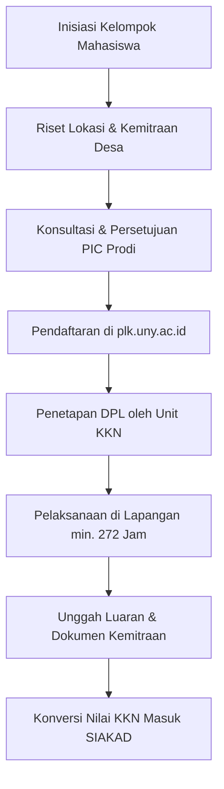
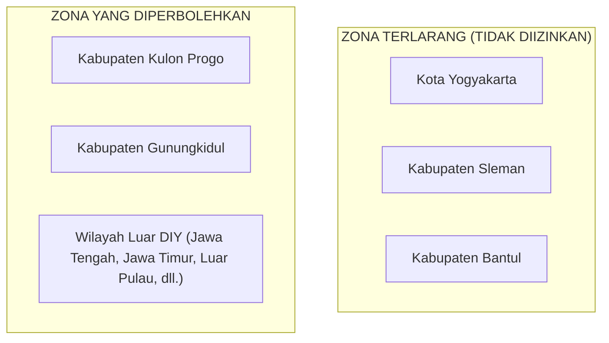
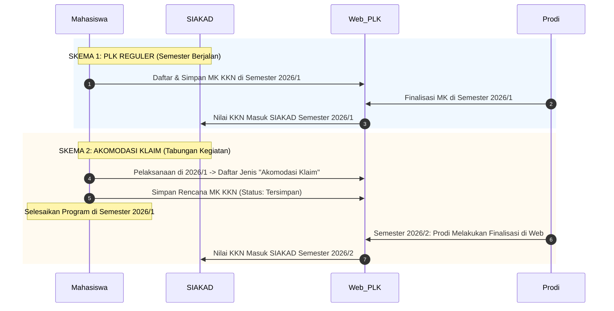
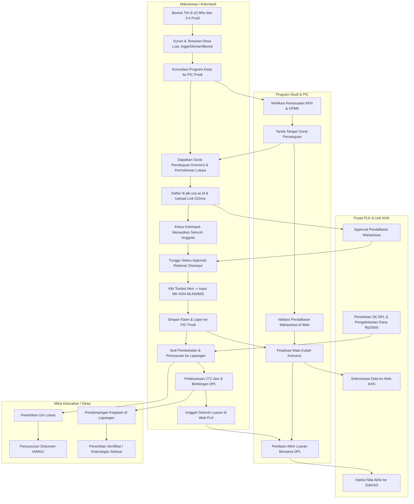

---
tags: [panduan, plk, mengabdi, kompilasi]
created: 2026-09-28
status: active
sumber: Kompilasi Panduan PLK + Dashboard + Sosialisasi
---

# Buku Panduan Lengkap & Pedoman Operasional: UNY Mengabdi (PLK UNY)

> **Dokumen Rujukan Resmi**: Panduan Pembelajaran Luar Kampus (PLK) 2025, Pedoman Dashboard PLK, & Sosialisasi Mahasiswa Semester Gasal 2026/2027  
> **Kanal & Sistem Resmi**: [plk.uny.ac.id](https://plk.uny.ac.id) | Akun SSO UNY | IG: [@plk_uny](https://instagram.com/plk_uny)  
> **Pengelola**: Unit KKN, PK, PI, dan Magang UNY bersama Tim Akademik / Taskforce PLK Universitas  

---

## Daftar Isi
1. [Ringkasan Eksekutif & Identitas Program](#1-ringkasan-eksekutif--identitas-program)
2. [Syarat Mutlak Peserta & Komposisi Kelompok](#2-syarat-mutlak-peserta--komposisi-kelompok)
3. [Zonasi Wilayah & Ketentuan Lokasi](#3-zonasi-wilayah--ketentuan-lokasi)
4. [Beban Durasi, Jam Kerja, & Konversi SKS](#4-beban-durasi-jam-kerja--konversi-sks)
5. [Skema Rekognisi: PLK Reguler vs Akomodasi Klaim](#5-skema-rekognisi-plk-reguler-vs-akomodasi-klaim)
6. [Bantuan Dana Program & Rekening Mahasiswa](#6-bantuan-dana-program--rekening-mahasiswa)
7. [Dokumen Persyaratan Administrasi](#7-dokumen-persyaratan-administrasi)
8. [Alur Kerja Lengkap (Bagan Swimlane Mermaid)](#8-alur-kerja-lengkap)
9. [Panduan Langkah Teknis Dashboard Web PLK](#9-panduan-langkah-teknis-dashboard-web-plk)
10. [Rincian Luaran Wajib (Deliverables) & Struktur Laporan](#10-rincian-luaran-wajib-deliverables--struktur-laporan)
11. [Jadwal & Timeline Pelaksanaan (Semester 2026/1)](#11-jadwal--timeline-pelaksanaan)
12. [Checklist Kesiapan Tim (Pra-Pendaftaran s.d. Pasca-Kegiatan)](#12-checklist-kesiapan-tim)

---

## 1. Ringkasan Eksekutif & Identitas Program

**UNY Mengabdi** adalah salah satu bentuk kegiatan unggulan dalam program Pembelajaran Luar Kampus (PLK) Universitas Negeri Yogyakarta. Program ini memfasilitasi mahasiswa untuk mendedikasikan ilmu pengetahuan, gagasan inovatif, tenaga, dan sumber daya secara langsung dalam pemberdayaan masyarakat dan proyek kemanusiaan di tingkat perdesaan/kelurahan.

- **Status Kegiatan**: Mandiri berkelompok dengan bimbingan DPL (Dosen Pembimbing Lapangan).
- **Mata Kuliah Rekognisi Utama**: **Kuliah Kerja Nyata (KKN)** dengan bobot **6 SKS** (Kode MK: `MLK60605`) serta dapat ditambah Mata Kuliah Tambahan Kompetensi (MKTK) sesuai persetujuan Program Studi (total maksimal 20 SKS).
- **Pembimbing Lapangan**: Ditugaskan langsung oleh **Tim Akademik / Unit KKN UNY**.



---

## 2. Syarat Mutlak Peserta & Komposisi Kelompok

Pembentukan tim harus mematuhi aturan baku berikut:

### A. Persyaratan Individu Mahasiswa
1. **SKS Tempuh**: Wajib telah menyelesaikan **minimal 100 SKS** pada saat mendaftar.
2. **Status Akademik**: Berstatus sebagai **Mahasiswa Aktif** pada pangkalan data PDDIKTI dan portal `registrasi.uny.ac.id` pada semester berjalan.
3. **Batas Partisipasi**: Mahasiswa hanya boleh mengikuti 1 program PLK per semester (maksimal akumulasi 2 semester sepanjang masa studi).
4. **Rekening Pribadi**: Wajib memiliki rekening bank aktif atas nama pribadi (bukan atas nama orang tua/teman) untuk keperluan mitigasi data PDDIKTI dan pencairan dana bantuan.

### B. Aturan Pembentukan & Komposisi Tim (Oprec)
1. **Jumlah Anggota**: **8 sampai 10 orang mahasiswa** per kelompok.
2. **Multidisiplin Ilmu**:
   - Wajib terdiri dari **minimal 3 sampai 4 Program Studi berbeda**.
   - **Tingkat Keterwakilan**: Minimal **2 mahasiswa per Program Studi**.
   - *Rekomendasi*: Dianjurkan terdiri dari mahasiswa lintas fakultas (misal: gabungan FIPP, FBSB, FMIPA, FT, FEB, FIKK, FISHIPOL) agar program kerja di desa mencakup aspek pendidikan, sains-teknologi, ekonomi kreatif, kesehatan/olahraga, dan sosial humaniora.
3. **Akun Pendaftaran**: Seluruh anggota kelompok wajib memiliki akun SSO di `plk.uny.ac.id`. Ketua kelompok bertindak sebagai perwakilan yang menautkan (*assign*) anggota ke dalam sistem pendaftaran web.

---

## 3. Zonasi Wilayah & Ketentuan Lokasi

Universitas menetapkan aturan zonasi wilayah yang sangat ketat untuk lokasi UNY Mengabdi:



### Rincian Aturan Lokasi:
1. **Di Luar Zona Terlarang**: Lokasi pengabdian **WAJIB berada di luar Kota Yogyakarta, Kabupaten Sleman, dan Kabupaten Bantul**.
2. **Bukan Lokasi KKN Reguler**: Dusun / padukuhan sasaran **tidak sedang digunakan** oleh kelompok KKN reguler dari Unit KKN UNY pada periode yang sama.
3. **Kuota per Kelurahan**: Minimal 1 kelompok dan maksimal 3 kelompok dalam 1 kelurahan/desa yang sama pada satu periode.
4. **Perizinan Mandiri**: Mahasiswa wajib mengurus perizinan ke instansi/desa secara mandiri dengan membawa **Surat Permohonan Lokasi PLK UNY** resmi dari universitas/fakultas.

---

## 4. Beban Durasi, Jam Kerja, & Konversi SKS

### A. Perhitungan Durasi Jam Kerja
Berdasarkan Standar Nasional Pendidikan Tinggi (SN-Dikti) dan buku panduan PLK UNY:
- **1 SKS Praktik Lapangan** setara dengan **45 jam per semester**.
- Untuk konversi mata kuliah berbobot **6 SKS** (seperti KKN atau Magang), mahasiswa wajib menempuh beban kerja lapangan minimal:

$$\mathbf{6\ SKS \times 45\ Jam = 270 \rightarrow Dibulatkan\ Menjadi\ 272\ Jam\ Kerja\ Nyata}$$

- Durasi 272 jam ini wajib terdistribusi secara terstruktur selama masa program (kurang lebih 4 bulan masa aktif) dan dibuktikan dalam **Logbook Harian** serta **Matriks Jam Kerja**.

### B. Paket Konversi Mata Kuliah
- **Mata Kuliah Utama**: `MLK60605` - **Kuliah Kerja Nyata (KKN)** = **6 SKS**.
- **Mata Kuliah Tambahan (Opsional)**: Dapat dikombinasikan dengan Mata Kuliah Tambahan Kompetensi (MKTK) atau mata kuliah prodi yang relevan (misal: Komunikasi Sosial, Kewirausahaan Sosial, Pemberdayaan Masyarakat) sebanyak 3–14 SKS, hingga batas akumulasi **maksimal 20 SKS per semester**.
- **Ketentuan Khusus**: Mata kuliah konversi **bukan untuk mengulang atau memperbaiki nilai** yang pernah diambil pada semester sebelumnya.

---

## 5. Skema Rekognisi: PLK Reguler vs Akomodasi Klaim

Mahasiswa dapat memilih salah satu dari dua skema pendaftaran sesuai rencana studi:



### Perbandingan Kedua Skema:

| Parameter | Skema PLK Reguler | Skema PLK Akomodasi Klaim |
| :--- | :--- | :--- |
| **Waktu Pelaksanaan** | Semester Berjalan (misal: Gasal 2026/1) | Semester Berjalan (misal: Gasal 2026/1) |
| **Waktu Rekognisi KKN** | Diakui pada Semester yang sama (2026/1) | Diakui pada Semester berikutnya (2026/2) |
| **Masa Kedaluwarsa** | Berakhir di semester berjalan | Berlaku maksimal **2 semester (1 tahun)** |
| **Status di Web PLK** | Langsung difinalisasi prodi pada semester 1 | Tersimpan di semester 1, difinalisasi di semester 2 |
| **Pilihan Sangat Cocok Bagi** | Mahasiswa yang ingin nilai KKN langsung keluar di KHS semester berjalan. | Mahasiswa yang beban SKS semester berjalannya sudah padat (mendekati 24 SKS) dan ingin mengalokasikan beban KKN di semester berikutnya. |

> [!CAUTION]
> #### Larangan Keras Terkait SIAKAD:
> - **JANGAN PERNAH mengambil mata kuliah KKN di KRS portal SIAKAD secara mandiri!**
> - Mata kuliah konversi KKN **HANYA diinput melalui Web PLK**.
> - Jika mata kuliah KKN terlanjur diambil di SIAKAD reguler, sistem PLK tidak dapat melakukan konversi dan mahasiswa akan diarahkan ke skema KKN reguler non-konversi.
> - Total beban SKS (SKS mata kuliah reguler + 6 SKS KKN PLK) dalam satu semester **tidak boleh melebihi 24 SKS**.

---

## 6. Bantuan Dana Program & Rekening Mahasiswa

Universitas memberikan dukungan finansial operasional bagi peserta program UNY Mengabdi:

- **Nominal Bantuan**: **Rp 250.000 / mahasiswa**.
- **Total Dana per Tim**: Jika kelompok beranggotakan 10 orang, maka total bantuan yang diterima adalah **Rp 2.500.000**.
- **Ketentuan Kolektif**: Seluruh bantuan yang masuk ke rekening masing-masing anggota **wajib dikumpulkan ke dalam kas bendahara kelompok** untuk dialokasikan sepenuhnya pada pelaksanaan program kerja di desa.
- **Syarat Rekening**:
  - Wajib rekening bank aktif atas nama mahasiswa sendiri.
  - Diinput pada menu Profil di portal `plk.uny.ac.id`.
- **Peringatan Penting PDDIKTI**: Mahasiswa yang telah mendaftar dan mata kuliahnya difinalisasi **tidak diizinkan mengundurkan diri**, karena pembatalan sepihak akan merusak validasi dan pelaporan data universitas di pangkalan PDDIKTI.

---

## 7. Dokumen Persyaratan Administrasi

Sebelum mengisi formulir pendaftaran di web, siapkan seluruh dokumen berikut dalam format PDF dan satukan ke dalam **1 Folder Google Drive**:

| No | Dokumen | Penanggung Jawab | Keterangan & Format |
| :---: | :--- | :---: | :--- |
| **1** | **Surat Permohonan Lokasi PLK UNY** | Ketua Kelompok | Ditujukan kepada Kepala Desa/Lurah mitra, memuat nama seluruh anggota tim dan prodi asal. Format mengacu pada template resmi 2026/1. |
| **2** | **Surat Persetujuan Konversi dari Prodi** | Masing-masing Anggota & PIC Prodi | Ditandatangani oleh Dosen PIC PLK Prodi dan Koordinator Program Studi (Koorprodi) masing-masing asal mahasiswa. |
| **3** | **Surat Pernyataan Kesediaan Menyelesaikan Program** | Seluruh Anggota | Surat bermaterai berisi komitmen menuntaskan 272 jam pengabdian dan mematuhi norma kampus/desa. |
| **4** | **Dokumen Kemitraan (IA / MoU / MoA)** | Ketua Tim & Mitra Desa | *Implementation Arrangement* (IA) antara UNY (Fakultas/Prodi) dengan Pemerintah Desa/Kelurahan setempat. |

> [!TIP]
> **Penyetelan Akses Google Drive**:  
> Pastikan link folder Google Drive disetel ke: **"Anyone with the link can view / Siapa saja yang memiliki link dapat melihat"**. Tautan yang terkunci/private akan menyebabkan verifikasi pendaftaran tertolak oleh admin universitas.

---

## 8. Alur Kerja Lengkap

Bagan swimlane di bawah ini memperlihatkan koordinasi antar-pihak sejak pra-pendaftaran hingga nilai terbit di KHS SIAKAD:



---

## 9. Panduan Langkah Teknis Dashboard Web PLK

Langkah-langkah operasional di portal [plk.uny.ac.id](https://plk.uny.ac.id):

### Langkah 1: Login & Profil
1. Buka [plk.uny.ac.id](https://plk.uny.ac.id) dan klik **Login SSO**.
2. Masukkan username email student dan password SSO UNY.
3. Buka menu **Profil**:
   - Pastikan data diri (NIK, No. HP WhatsApp aktif) valid.
   - Masukkan **Nama Bank** dan **Nomor Rekening Pribadi** (wajib atas nama mahasiswa bersangkutan).

### Langkah 2: Tambah Pendaftaran
1. Masuk ke sidebar menu **Pendaftaran** -> Klik **`+ Tambah Pendaftaran`**.
2. Pilih form input:
   - **Jenis Program**: Pilih `PLK Reguler` (jika klaim di semester yang sama) atau `PLK Akomodasi Klaim` (jika klaim di semester berikutnya).
   - **Program**: Pilih **`UNY Mengabdi 2026/1`**.
   - **Link Surat Konversi**: Tempelkan (*paste*) tautan folder Google Drive yang memuat:
     1. Surat Persetujuan Konversi Prodi
     2. Surat Pernyataan Kesediaan
     3. Surat Permohonan Lokasi
3. Klik **Simpan**.

### Langkah 3: Pengelompokan Anggota (Khusus Ketua)
1. Setelah pendaftaran terbuat, buka rincian kelompok.
2. Ketua tim menginputkan NIM anggota kelompoknya yang sudah terdaftar di sistem hingga kuota 8–10 mahasiswa terpenuhi.

### Langkah 4: Menunggu Approval Rektorat
- Pantau tabel pendaftaran pada kolom **Approve Rektorat**.
- Tunggu hingga verifikator universitas mengubah status menjadi **"Disetujui"** (ikon badge hijau).

### Langkah 5: Input Mata Kuliah Konversi
1. Setelah berstatus disetujui, klik tombol **Aksi** (ikon dokumen hijau di ujung kanan baris).
2. Di halaman *Klaim Mata Kuliah*, klik tombol **`Pilih Mata Kuliah`**.
3. Cari mata kuliah:
   - Ketik: **`Kuliah Kerja Nyata`** atau kode **`MLK60605`** (6 SKS).
4. Beri centang pada kotak pilihan mata kuliah.
5. Klik tombol **`Simpan Klaim`**.
6. Muncul pop-up konfirmasi **"Berhasil"**. Klik **OK**.
7. Periksa tabel: Status mata kuliah pada kolom *KRS Konversi PLK* akan bertuliskan **"Tersimpan"** dengan label kelas **`PLK`**.

### Langkah 6: Konfirmasi Finalisasi ke Prodi
- Status "Tersimpan" berarti nilai belum masuk SIAKAD.
- Mahasiswa/Ketua Tim wajib segera menghubungi **PIC PLK Prodi / Koorprodi** untuk melakukan proses **Finalisasi di Web PLK**.
- Setelah prodi menekan tombol finalisasi, mata kuliah KKN resmi terinjeksi ke dalam KRS SIAKAD.

---

## 10. Rincian Luaran Wajib (Deliverables) & Struktur Laporan

Setiap kelompok UNY Mengabdi wajib menyusun dan mengunggah dokumen luaran berikut pada akhir periode:

### A. Matriks Checklist Luaran UNY Mengabdi
| No | Jenis Luaran | Sifat | Ketentuan Format |
| :---: | :--- | :---: | :--- |
| 1 | **Laporan Akhir Kegiatan** | **Wajib** | Format PDF terstandarisasi sesuai sistematika resmi UNY (Bab I–IV). |
| 2 | **Logbook Aktivitas Berkala** | **Wajib** | Berisi catatan harian kegiatan lapangan kumulatif minimal 272 jam per mahasiswa. |
| 3 | **Karya Rekaman Video Kegiatan** | **Wajib** | Video dokumentasi sinematik program kerja (durasi 3–7 menit, resolusi minimal 1080p, diunggah ke YouTube/Drive). |
| 4 | **Foto Dokumentasi Pendukung** | **Wajib** | Foto representatif tahapan hulu ke hilir (persiapan, pelaksanaan, dan penyerahan hasil program). |
| 5 | **Draft Naskah Berita (5W1H)** | **Wajib** | Naskah artikel populer siap rilis yang memuat *Who, What, When, Where, Why, How* dan dampak sosial kegiatan (untuk portal uny.ac.id). |
| 6 | **Dokumen Kemitraan (IA / MoU)** | **Wajib** | Naskah kerja sama resmi yang telah ditandatangani oleh pimpinan desa/kelurahan dan pejabat UNY. |
| 7 | **Surat Keterangan / Sertifikat** | **Wajib** | Diterbitkan oleh Kepala Desa / Lurah setempat yang menyatakan kelompok telah menyelesaikan seluruh program kerja. |
| 8 | **Produk Inovasi / TTG** | *Opsional* | Prototipe alat, teknologi tepat guna, modul pelatihan desa, atau plang informasi/peta potensi desa. |

---

### B. Sistematika Format Laporan Akhir (Standar UNY)

```markdown
HALAMAN SAMPUL (Memuat Judul, Logo UNY, Nama & NIM Seluruh Anggota, Fakultas, Tahun 2026)
HALAMAN PENGESAHAN (Ditandatangani Kepala Desa/Lurah, DPL, Koorprodi, dan Wakil Dekan AKA)
ABSTRAK (Maks. 1 Halaman, 3 Alinea: Tujuan, Metode & Lokasi, Hasil/Dampak, Kata Kunci)
PRAKATA (Ucapan syukur dan apresiasi kepada Rektor, Mitra, DPL, serta Pihak Terkait)
DAFTAR ISI
DAFTAR TABEL
DAFTAR GAMBAR / FOTO
DAFTAR LAMPIRAN

BAB I: PENDAHULUAN
  A. Analisis Situasi (Profil demografi, geografis, potensi, dan permasalahan desa mitra)
  B. Identifikasi dan Rumusan Masalah
     1. Identifikasi Masalah
     2. Rumusan Masalah
  C. Tujuan Kegiatan (Tujuan umum & khusus pemberdayaan masyarakat)
  D. Manfaat Kegiatan (Bagi mahasiswa, masyarakat desa, dan universitas)

BAB II: METODE KEGIATAN
  A. Kerangka Pemecahan Masalah
  B. Kelompok Sasaran (Masyarakat umum, kelompok tani, UMKM, karang taruna, anak sekolah, dll.)
  C. Metode dan Prosedur Pelaksanaan Kegiatan (Sosialisasi, pelatihan, workshop, pendampingan)
  D. Rancangan Evaluasi (Parameter keberhasilan dan indikator capaian)

BAB III: PELAKSANAAN KEGIATAN
  A. Hasil Pelaksanaan Kegiatan (Rincian seluruh program kerja pokok dan tambahan)
  B. Pembahasan (Analisis ketercapaian program dengan teori/keilmuan)
  C. Evaluasi Kegiatan (Tingkat partisipasi masyarakat dan efektivitas solusi)
  D. Faktor Pendukung Kegiatan
  E. Faktor Penghambat Kegiatan dan Solusi yang Diambil

BAB IV: SIMPULAN DAN SARAN
  A. Simpulan (Ringkasan hasil pengabdian masyarakat)
  B. Saran (Rekomendasi tindak lanjut bagi pemerintah desa dan pengelola PLK)

DAFTAR PUSTAKA
LAMPIRAN
  1. Matriks Program Kerja & Logbook Harian (Pemenuhan 272 Jam)
  2. Naskah Draft Berita (5W1H)
  3. Dokumen Kerjasama (Implementation Arrangement / IA yang sudah bertanda tangan)
  4. Surat Izin Lokasi & Surat Keterangan Selesai dari Kepala Desa
  5. Foto-Foto Kegiatan Berkualitas Tinggi
  6. Rincian Realisasi Penggunaan Anggaran / Kas Kelompok
```

---

## 11. Jadwal & Timeline Pelaksanaan

Kalender resmi operasional PLK UNY Semester Gasal 2026/2027 (2026/1):

| No | Tahapan Kegiatan | Rentang Waktu Pelaksanaan | Keterangan / Deadline |
| :---: | :--- | :--- | :--- |
| **1** | **Periode Pendaftaran Mahasiswa** | **20 Juli s/d 4 Agustus 2026** | **Ditutup 4 Agustus 2026, Pukul 20.00 WIB** |
| **2** | **Approval & Finalisasi MK oleh Prodi** | 25 Juli s/d 6 Agustus 2026 | Batas akhir sistem KRS PLK ditutup |
| **3** | **Pembekalan & Penerjunan Kelompok** | 5 Agustus s/d 6 Agustus 2026 | Diselenggarakan oleh Tim Unit KKN |
| **4** | **Pelaksanaan Program di Desa** | **7 Agustus s/d 6 Desember 2026** | **Memenuhi akumulasi minimal 272 jam** |
| **5** | **Unggah Laporan & Luaran di Web** | **7 Desember s/d 18 Desember 2026** | **Ditutup 18 Desember 2026, Pukul 16.00 WIB** |
| **6** | **Penilaian oleh DPL & Tim PLK** | 21 Desember s/d 30 Desember 2026 | Evaluasi laporan dan bukti kerja |
| **7** | **Injeksi Nilai Resmi ke SIAKAD** | 21 Desember s/d 31 Desember 2026 | Nilai KKN tampil di KHS mahasiswa |

---

## 12. Checklist Kesiapan Tim

Gunakan daftar periksa (*action items*) berikut sebelum melangkah:

### Fase 1: Pembentukan Tim & Open Recruitment (Oprec)
- [ ] Anggota kelompok terkumpul berjumlah 8 sampai 10 orang mahasiswa.
- [ ] Seluruh calon anggota dipastikan telah menempuh minimal 100 SKS.
- [ ] Tim memenuhi syarat multidisiplin: berasal dari minimal 3–4 prodi berbeda.
- [ ] Setiap prodi memiliki keterwakilan minimal 2 orang mahasiswa.
- [ ] Menentukan Ketua Kelompok, Sekretaris, dan Bendahara.

### Fase 2: Survei & Penentuan Lokasi Mitra
- [ ] Memastikan lokasi calon desa sasaran **berada di luar Kota Yogyakarta, Sleman, dan Bantul** (rekomendasi: Kulon Progo, Gunungkidul, atau luar DIY).
- [ ] Mengonfirmasi ke pihak kantor desa bahwa pedukuhan target **bebas dari kelompok KKN reguler UNY**.
- [ ] Memastikan jumlah kelompok PLK di kelurahan tersebut tidak lebih dari 3 kelompok.
- [ ] Menyusun draf rancangan program kerja sesuai kebutuhan riil masyarakat setempat.

### Fase 3: Administrasi & Pendaftaran Web
- [ ] Menghubungi Dosen PIC PLK Prodi masing-masing anggota untuk konsultasi.
- [ ] Menerbitkan Surat Persetujuan Konversi dari masing-masing prodi.
- [ ] Mengurus Surat Permohonan Lokasi resmi.
- [ ] Mengisi Surat Pernyataan Kesediaan bermaterai.
- [ ] Memastikan seluruh anggota mengisi nomor rekening bank pribadi di web PLK.
- [ ] Mengunggah berkas ke Google Drive publik dan mendaftar di [plk.uny.ac.id](https://plk.uny.ac.id).
- [ ] Ketua tim menautkan seluruh anggota kelompok di web.
- [ ] Memantau Approval Rektorat hingga berstatus "Disetujui".
- [ ] Memasukkan mata kuliah konversi KKN (`MLK60605` - 6 SKS) dan menyimpan klaim.
- [ ] Melaporkan ke PIC Prodi agar segera melakukan finalisasi mata kuliah di dashboard admin.

### Fase 4: Pelaksanaan & Penuntasan Luaran
- [ ] Menjalankan kegiatan lapangan secara konsisten hingga mencapai minimal 272 jam.
- [ ] Mengisi logbook aktivitas harian secara tertib dan berkala.
- [ ] Mengambil rekaman video dan foto dokumentasi kegiatan dengan kualitas baik.
- [ ] Menyusun naskah berita 5W1H dan menyerahkan draf dokumen kerja sama (IA) ke desa.
- [ ] Menyusun Laporan Akhir sesuai format Bab I–IV dan meminta tanda tangan pengesahan.
- [ ] Mengunggah seluruh luaran sebelum tenggat waktu resmi 18 Desember pukul 16.00 WIB.
