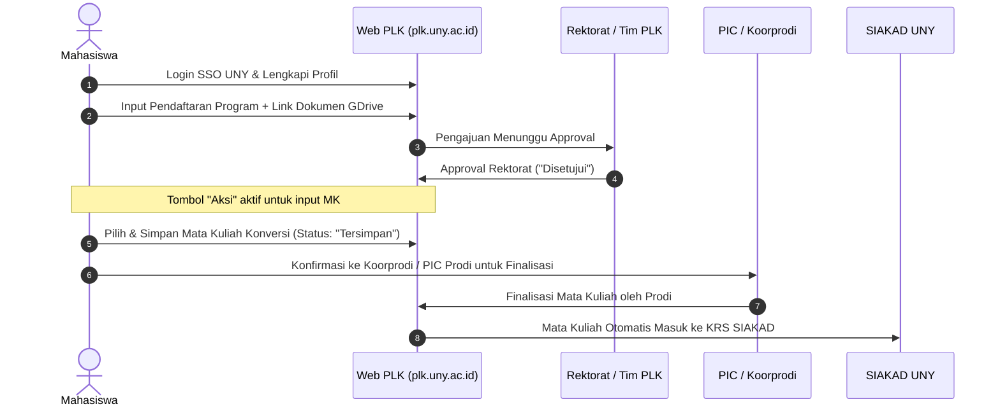

---
tags: [panduan, plk, dashboard, teknis]
created: 2026-09-28
status: active
sumber: WIP - Panduan Dashboard PLK UNY 2026
---

# Panduan Dashboard & Pedoman Pelaksanaan PLK UNY

> **Sumber Dokumen**: WIP - Panduan Dashboard PLK & Pedoman Pelaksanaan Pembelajaran Luar Kampus Universitas Negeri Yogyakarta  
> **Tahun Akademik**: 2026/2027 (Semester 2026/1)  
> **Akses Sistem**: [plk.uny.ac.id](https://plk.uny.ac.id) | Akun SSO UNY | IG: [@plk_uny](https://instagram.com/plk_uny)

---

## Daftar Isi
- [BAGIAN 1: Panduan Teknis Dashboard Mahasiswa (Langkah 1 - 11)](#bagian-1-panduan-teknis-dashboard-mahasiswa)
  - [Langkah 1 & 2: Akses & Login SSO](#langkah-1--2-akses--login-sso)
  - [Langkah 3 & 4: Profil & Pendaftaran](#langkah-3--4-profil--pendaftaran)
  - [Langkah 5: Memilih Jenis Program (Akomodasi Klaim vs Reguler)](#langkah-5-memilih-jenis-program)
  - [Langkah 6: Memilih Program & Upload Link Dokumen](#langkah-6-memilih-program--upload-link-dokumen)
  - [Langkah 7: Approval Rektorat](#langkah-7-approval-rektorat)
  - [Langkah 8: Memasukkan Mata Kuliah Konversi](#langkah-8-memasukkan-mata-kuliah-konversi)
  - [Langkah 9 & 10: Pemilihan & Penyimpanan Mata Kuliah](#langkah-9--10-pemilihan--penyimpanan-mata-kuliah)
  - [Langkah 11: Validasi Status Tersimpan & Finalisasi](#langkah-11-validasi-status-tersimpan--finalisasi)
- [BAGIAN 2: Pedoman Pelaksanaan & Regulasi Akademik](#bagian-2-pedoman-pelaksanaan--regulasi-akademik)
  - [Bab I: Pendahuluan & Ketentuan Konversi SKS](#bab-i-pendahuluan--ketentuan-konversi-sks)
  - [Matriks Konversi Mata Kuliah](#matriks-konversi-mata-kuliah)
  - [Bab II: Bentuk Kegiatan PLK (7 Program Utama + 2 Skema Akomodasi)](#bab-ii-bentuk-kegiatan-plk)
  - [Matriks Luaran Kegiatan PLK (Tabel Lengkap)](#matriks-luaran-kegiatan-plk)

---

# BAGIAN 1: Panduan Teknis Dashboard Mahasiswa

### Langkah 1 & 2: Akses & Login SSO
1. Buka peramban dan akses alamat portal resmi: [plk.uny.ac.id](https://plk.uny.ac.id).
2. Klik tombol **Login** dan masuk menggunakan akun **Single Sign-On (SSO) UNY** (email student dan password SSO).

### Langkah 3 & 4: Profil & Pendaftaran
3. **Lengkapi Profil**: Mahasiswa wajib memeriksa dan melengkapi data identitas diri, kontak aktif, dan data rekening bank pribadi pada menu Profil.
4. **Masuk Menu Pendaftaran**: Buka sidebar menu **Pendaftaran** lalu klik tombol **`+ Tambah Pendaftaran`** di pojok kanan atas.

### Langkah 5: Memilih Jenis Program
Pada modal formulir pendaftaran, tentukan jenis program yang sesuai:

| Jenis Program | Karakteristik & Sasaran | Batas Waktu Klaim |
| :--- | :--- | :--- |
| **PLK Reguler** | Mahasiswa yang melaksanakan kegiatan dan mengajukan rekognisi konversi mata kuliah **pada semester yang sama**. | Selesai pada semester berjalan. |
| **PLK Akomodasi Klaim** | Mahasiswa yang melaksanakan kegiatan pada **semester berjalan** (misal: Semester Gasal 2026/1), sedangkan klaim mata kuliah konversinya diajukan pada **semester berikutnya** (misal: Semester Genap 2026/2). | Tabungan kegiatan dapat dikonversi **maksimal 2 semester (1 tahun)** setelah kegiatan selesai. |

> [!IMPORTANT]
> Mahasiswa wajib berkonsultasi terlebih dahulu dengan **PIC PLK Program Studi** sebelum memilih program dan menginputkan rencana konversi.

### Langkah 6: Memilih Program & Upload Link Dokumen
Pilih nama program spesifik (misal: *UNY Mengabdi 2026/1*, *UNY Magang 2026/1*, dsb.), kemudian masukkan **tautan link Google Drive** yang berisi berkas persyaratan:
1. **Surat Persetujuan Konversi dari Prodi** (wajib ditandatangani PIC PLK dan Koorprodi).
2. **Surat Pernyataan Kesediaan Menyelesaikan Program** (bermaterai dari mahasiswa).
3. **Surat Permohonan Lokasi** *(Khusus peserta UNY Mengabdi, UNY Magang, UNY Mengajar)*.
4. **Surat Rekomendasi Atas Prestasi dari DAKA** *(Khusus peserta Akomodasi Klaim PRESMA)*.

> [!WARNING]
> Pastikan hak akses link Google Drive telah disetel ke **"Anyone with the link can view / Siapa saja yang memiliki link dapat melihat"** (tidak terkunci/private).

### Langkah 7: Approval Rektorat
Setelah data tersimpan, mahasiswa memantau status pendaftaran pada tabel *Daftar Pendaftaran Program*:
- Status awal: *Menunggu Approval Rektorat*.
- Mahasiswa menunggu hingga kolom **Approve Rektorat** berubah status menjadi **"Disetujui"** (badge hijau).
- Setelah disetujui, tombol **Aksi** (ikon dokumen warna hijau) akan aktif untuk mulai memasukkan mata kuliah konversi.

### Langkah 8: Memasukkan Mata Kuliah Konversi
Klik tombol **Aksi** untuk masuk ke antarmuka *Klaim Mata Kuliah*. Perhatikan ketentuan operasional berikut:

> [!CAUTION]
> #### Aturan Kritis Klaim Mata Kuliah:
> 1. **Masa Pembukaan Klaim**: Sesuai rentang jadwal aktif sistem (contoh periode: *19 Juli 2026 s.d. 06 Agustus 2026 pukul 20.00 WIB*).
> 2. **Status Lulus**: Mahasiswa harus sudah berstatus lulus program untuk dapat melakukan klaim mata kuliah (pada skema klaim).
> 3. **Registrasi Aktif**: Mahasiswa wajib berstatus **Aktif** semester berjalan pada sistem `registrasi.uny.ac.id`.
> 4. **Kesesuaian Matkul**: Mata kuliah yang diinput **harus sama persis** dengan yang tertera di Surat Persetujuan Konversi Prodi.
> 5. **Batas Beban SKS**: Akumulasi beban SKS (SKS tempuh reguler + SKS MBKM/PLK) dalam 1 semester **tidak boleh melebihi 24 SKS**.
> 6. **Larangan Input di SIAKAD**: Mata kuliah konversi **HANYA diinput melalui Web PLK**, TIDAK BOLEH diambil di portal SIAKAD. Jika mata kuliah sudah terlanjur diinput di SIAKAD reguler, mata kuliah tersebut tidak dapat diklaim melalui PLK dan nilainya akan diproses reguler.
> 7. **Penghapusan MK**: Mata kuliah yang sudah difinalisasi oleh Prodi tidak dapat dihapus melalui Web PLK. Penghapusan hanya bisa dilakukan melalui `siakad.uny.ac.id` selama periode KRS masih buka.

### Langkah 9 & 10: Pemilihan & Penyimpanan Mata Kuliah
1. Klik tombol **`Pilih Mata Kuliah`**.
2. Cari mata kuliah berdasarkan kode atau nama (misal: `DEM90303 - Filsafat Manajemen Pendidikan`).
3. Beri tanda centang pada mata kuliah yang dipilih.
4. Klik tombol hijau **`Simpan Klaim`**.
5. Muncul modal notifikasi **"Berhasil: Klaim mata kuliah berhasil disimpan. Silakan konfirmasi kepada Koorprodi atau PIC Prodi untuk melakukan finalisasi mata kuliah."** -> Klik **OK**.

### Langkah 11: Validasi Status Tersimpan & Finalisasi
- Periksa kolom **KRS Konversi PLK**: Mata kuliah yang berhasil disimpan akan berstatus badge hijau **"Tersimpan"** dengan label kelas **`PLK`**.
- Status ini menandakan mata kuliah baru tersimpan di database Web PLK dan **belum masuk ke SIAKAD**.
- **Langkah Terakhir**: Mahasiswa segera melapor/konfirmasi ke **PIC PLK Prodi / Koorprodi** agar prodi melakukan **Finalisasi** di dashboard admin. Setelah difinalisasi oleh prodi, mata kuliah akan otomatis terinjeksi ke KRS SIAKAD mahasiswa.

---

# BAGIAN 2: Pedoman Pelaksanaan & Regulasi Akademik

### Bab I: Pendahuluan & Ketentuan Konversi SKS

#### Konversi Jam ke SKS
- Jumlah SKS konversi dihitung berdasarkan durasi kegiatan:  
  $$\mathbf{1\ SKS\ Praktik\ Lapangan = 45\ Jam\ per\ Semester}$$
- Khusus untuk konversi mata kuliah sebesar **6 SKS** (seperti Praktik Kependidikan, Magang, PKL, PI, atau Kuliah Kerja Nyata / KKN), mahasiswa **wajib menempuh kegiatan minimal selama 272 jam** yang dibuktikan melalui logbook aktivitas dan matriks kegiatan.

#### Mekanisme Pendaftaran Berdasarkan Waktu Rekognisi
1. **PLK Reguler**: Program dan mata kuliah konversi didaftarkan dan direkognisi pada semester yang sama dengan pelaksanaan kegiatan.
2. **Akomodasi Klaim**: Kegiatan didaftarkan dan dilaksanakan pada semester berjalan, sedangkan pengajuan klaim mata kuliah konversi dilakukan pada semester berikutnya (maksimal 2 semester / 1 tahun setelah kegiatan tuntas).

---

### Matriks Konversi Mata Kuliah

| Program PLK | Mata Kuliah Konversi yang Sesuai |
| :--- | :--- |
| **UNY Magang** | Konversi ke **PI / PKL / Magang / PIT / PIM** dan/atau MK Prodi yang relevan. |
| **UNY Mengajar** | Konversi ke **Praktik Kependidikan (PK)** dan/atau MK Prodi yang relevan. |
| **UNY Meneliti** | Konversi ke MK **Metodologi Penelitian**, **Statistika**, atau MK dengan pendekatan riset / tugas akhir. |
| **UNY Mengabdi** | Konversi ke **Kuliah Kerja Nyata (KKN)** dan/atau MK Prodi yang relevan. |
| **UNY Pertukaran Mahasiswa** | Konversi ke **Mata Kuliah (MK) kurikulum prodi** yang disetarakan silabusnya. |
| **UNY Studi Mandiri** | Konversi ke **MK Prodi yang sesuai** / MKTK / keahlian industri spesifik. |
| **UNY Wirausaha** | Konversi ke **KKN / PI / PKL / Magang / Kewirausahaan** dan/atau MK Prodi yang relevan. |
| **Akomodasi Klaim** | Mengikuti ketentuan konversi dari bentuk kegiatan program PLK yang dijalankan. |
| **Akomodasi Klaim Prestasi (Presma)** | Konversi prestasi ke MK yang relevan berdasarkan rekomendasi jumlah SKS dari DAKA dan persetujuan Prodi (diizinkan untuk mengulang MK pada kurikulum baru). |

---

### Bab II: Bentuk Kegiatan PLK

#### 1. UNY Magang
- **Deskripsi**: Pengalaman kerja nyata di DUDIKA, BUMN, instansi pemerintah, atau lembaga mitra.
- **Persyaratan**: Minimal menempuh 4 semester (atau ketentuan prodi), perseorangan/kelompok, mitra berbadan hukum, didampingi DPL dan mentor mitra.
- **Beban Waktu**: Minimal setara 272 jam kerja lapangan.

#### 2. UNY Mengajar
- **Deskripsi**: Asistensi pembelajaran di satuan pendidikan dasar, menengah, madrasah, atau lembaga nonformal.
- **Persyaratan**: Minimal menyelesaikan **100 SKS**, nilai MK kependidikan minimal **B**, kelompok mandiri kolaborasi lintas prodi, lokasi mandiri di luar sekolah mitra PK reguler, menanggung transportasi mandiri, didampingi DPL dan Guru Pamong.
- **Beban Waktu**: Minimal setara 272 jam.

#### 3. UNY Meneliti
- **Deskripsi**: Riset saintifik di pusat studi, laboratorium, atau lembaga riset nasional (BRIN/LIPI).
- **Persyaratan**: Minimal semester 5 atau sudah/sedang menempuh Metodologi Penelitian/Statistika, mandiri/tim riset, **wajib bersama minimal 1 dosen UNY**, didampingi pembimbing dari Pusat Unggulan IPTEKS (PUI) UNY.

#### 4. UNY Mengabdi
- **Deskripsi**: Pemberdayaan masyarakat dan proyek kemanusiaan di perdesaan.
- **Persyaratan**: Minimal menyelesaikan **100 SKS**, kelompok 8–10 mahasiswa terdiri dari 3–4 program studi (minimal 2 mahasiswa/prodi), kuota kelurahan 1–3 kelompok, **lokasi di luar Kota Yogyakarta, Kab. Sleman, dan Kab. Bantul**, di luar pedukuhan KKN reguler, didampingi DPL dari Tim PLK.
- **Beban Waktu**: Minimal setara 272 jam.

#### 5. UNY Pertukaran Mahasiswa
- **Deskripsi**: Mengambil kelas selama 1 semester di perguruan tinggi dalam atau luar negeri.
- **Persyaratan**: Minimal menempuh 3 semester, mandiri/kelompok, PT mitra memiliki kerja sama aktif dengan prodi/UNY, perizinan mandiri, durasi minimal 1 semester.

#### 6. UNY Studi Mandiri
- **Deskripsi**: Kursus terstruktur intensif (*bootcamp*) dan penyelesaian proyek riil bersama DUDIKA.
- **Persyaratan**: Minimal menempuh 4 semester, mandiri/kelompok, kurikulum pelatihan terstandarisasi industri, didampingi dosen dan instruktur industri.

#### 7. UNY Wirausaha
- **Deskripsi**: Inkubasi dan perintisan bisnis baru secara terarah.
- **Persyaratan**: Minimal menempuh 3 semester, mandiri atau kelompok maksimal 5 orang, modal mandiri, proposal bisnis komprehensif, **wajib usaha rintisan baru** (bukan bisnis yang telah berjalan sebelumnya), didampingi dosen pembimbing dari Tim PLK / Inkubator Bisnis.

#### 8. Skema Akomodasi Klaim
- **Deskripsi**: Skema tabungan kegiatan untuk direkognisi pada semester berikutnya.
- **Persyaratan**: Mahasiswa aktif saat kegiatan dan saat pengajuan klaim, terdaftar di Web PLK sejak semester pelaksanaan, batas kedaluwarsa klaim **maksimal 1 tahun (2 semester)** pasca kegiatan selesai.

#### 9. Skema Akomodasi Klaim Prestasi Mahasiswa (Presma)
- **Deskripsi**: Rekognisi akademik atas prestasi kompetisi tingkat nasional/internasional dari ajang Belmawa Kemdiktisaintek.
- **Persyaratan**: Mahasiswa aktif saat juara dan saat klaim, bukti sertifikat/prestasi sah, rekomendasi SKS dari Direktorat Kemahasiswaan dan Alumni (DAKA), persetujuan MK konversi oleh PIC PLK dan Koorprodi (dapat digunakan untuk mengulang mata kuliah pada kurikulum baru).

---

### Matriks Luaran Kegiatan PLK

Berikut adalah matriks checklist luaran wajib dan luaran khusus yang harus diunggah di [plk.uny.ac.id](https://plk.uny.ac.id):

| Jenis Luaran Kegiatan | Pertukaran Mahasiswa | Magang | Mengajar | Meneliti | Mengabdi | Wirausaha | Studi Mandiri | Klaim Presma |
| :--- | :---: | :---: | :---: | :---: | :---: | :---: | :---: | :---: |
| **Laporan Kegiatan** | ✓ | ✓ | ✓ | ✓ | ✓ | ✓ | ✓ | ✓ |
| **Logbook Aktivitas Harian** | ✓ | ✓ | ✓ | ✓ | ✓ | ✓ | ✓ | ✓ |
| **Karya Rekaman Video Kegiatan** | ✓ | ✓ | ✓ | ✓ | ✓ | ✓ | ✓ | - |
| **Foto Dokumentasi Pendukung** | ✓ | ✓ | ✓ | ✓ | ✓ | ✓ | ✓ | ✓ |
| **Draft Berita (Metode 5W1H)** | ✓ | ✓ | ✓ | ✓ | ✓ | ✓ | ✓ | ✓ |
| **Sertifikat Mitra / Surat Keterangan / Piagam** | ✓ | ✓ | ✓ | ✓ | ✓ | - | ✓ | ✓ |
| **Dokumen Kerja Sama (IA / MoA / MoU)** | ✓ | ✓ | ✓ | - | ✓ | ✓ | - | - |
| **Transkrip Nilai Kampus Mitra** | ✓ | - | - | - | - | - | - | - |
| **Artikel Jurnal Ilmiah (SINTA / Scopus)** | - | - | - | ✓ | - | - | - | - |
| **Laporan Keuangan & Omzet Usaha** | - | - | - | - | - | ✓ | - | - |
| **Link Media Sosial Resmi Usaha** | - | - | - | - | - | ✓ | - | - |

*(Catatan: Template dokumen kerja sama menyesuaikan dengan format yang berlaku di program studi masing-masing).*