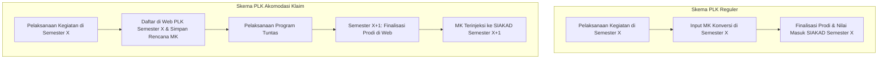
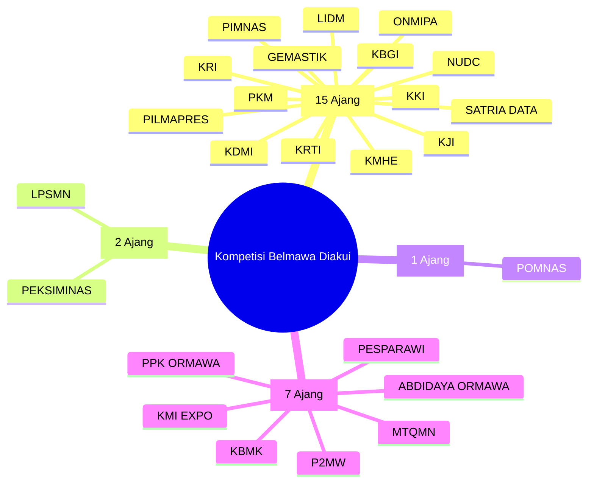
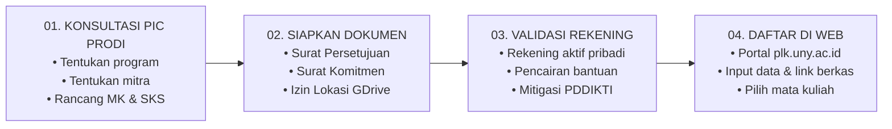

---
tags: [panduan, plk, sosialisasi]
created: 2026-09-28
status: active
sumber: WIP - Bahan Sosialisasi Mahasiswa PLK UNY
---

# Sosialisasi Pembelajaran Luar Kampus (PLK) & Akomodasi Klaim UNY

> **Sumber Dokumen**: WIP - Bahan Sosialisasi Mahasiswa PLK Universitas Negeri Yogyakarta  
> **Periode Pelaksanaan**: Semester Gasal 2026/2027 (Semester 2026/1)  
> **Jadwal Sosialisasi**: Selasa, 21 Juli 2026  
> **Kanal Resmi**: Portal: [plk.uny.ac.id](https://plk.uny.ac.id) | Web: [uny.ac.id](https://www.uny.ac.id) | Instagram: [@plk_uny](https://instagram.com/plk_uny)

---

## Daftar Isi
- [Ringkasan Eksekutif & Skema Konversi](#ringkasan-eksekutif--skema-konversi)
- [Mekanisme: PLK Reguler vs Akomodasi Klaim](#mekanisme-plk-reguler-vs-akomodasi-klaim)
- [Studi Kasus Alur Akomodasi Klaim](#studi-kasus-alur-akomodasi-klaim)
- [Data Historis Sebaran Pendaftar Program 2025/2](#data-historis-sebaran-pendaftar-program-20252)
- [Ketentuan Khusus Program Prioritas](#ketentuan-khusus-program-prioritas)
  - [1. UNY Mengabdi](#1-uny-mengabdi)
  - [2. UNY Magang](#2-uny-magang)
  - [3. UNY Mengajar](#3-uny-mengajar)
- [Akomodasi Klaim Prestasi Mahasiswa (PRESMA)](#akomodasi-klaim-prestasi-mahasiswa-presma)
  - [Daftar 25 Kompetisi Resmi Belmawa Kemdiktisaintek yang Diakui](#daftar-25-kompetisi-resmi-belmawa-kemdiktisaintek-yang-diakui)
  - [Prosedur Konversi Prestasi Presma](#prosedur-konversi-prestasi-presma)
- [Bantuan Dana Program PLK](#bantuan-dana-program-plk)
- [Penetapan Dosen Pembimbing Lapangan (DPL)](#penetapan-dosen-pembimbing-lapangan-dpl)
- [4 Tahapan Wajib Sebelum Mendaftar di Web](#4-tahapan-wajib-sebelum-mendaftar-di-web)
- [Timeline Program PLK Semester Gasal 2026/1](#timeline-program-plk-semester-gasal-20261)

---

## Ringkasan Eksekutif & Skema Konversi

Program Pembelajaran Luar Kampus (PLK) UNY memfasilitasi rekognisi kegiatan mandiri mahasiswa ke dalam mata kuliah kurikulum program studi:

| Program PLK | Pemetaan Mata Kuliah Konversi |
| :--- | :--- |
| **UNY Magang** | Konversi ke **PI / PKL / Magang / PIT / PIM** dan/atau MK prodi yang relevan. |
| **UNY Mengajar** | Konversi ke **Praktik Kependidikan (PK)** dan/atau MK prodi yang relevan. |
| **UNY Meneliti** | Konversi ke MK **Metodologi Penelitian**, **Statistika**, atau MK riset. |
| **UNY Mengabdi** | Konversi ke **Kuliah Kerja Nyata (KKN)** dan/atau MK prodi yang relevan. |
| **UNY Pertukaran Mahasiswa** | Konversi ke **Mata Kuliah (MK) kurikulum prodi** yang disetarakan. |
| **UNY Studi Mandiri** | Konversi ke **MK prodi yang sesuai** / keahlian kompetensi industri. |
| **UNY Wirausaha** | Konversi ke **KKN / PI / PKL / Magang / Kewirausahaan** dan/atau MK prodi. |
| **Akomodasi Klaim** | Mengikuti konversi mata kuliah program PLK yang dijalankan. |
| **Akomodasi Klaim PRESMA** | Konversi prestasi ke MK prodi yang disetujui (diizinkan mengulang MK kurikulum baru). |

---

## Mekanisme: PLK Reguler vs Akomodasi Klaim

1. **PLK Reguler**:
   - Pelaksanaan program dan pengajuan rekognisi mata kuliah konversinya dilakukan pada **semester yang sama**.
2. **PLK Akomodasi Klaim**:
   - Mahasiswa melaksanakan kegiatan pada **semester berjalan** (misal: 2026/1), sedangkan rekognisi mata kuliah konversinya diajukan pada **semester berikutnya** (misal: 2026/2).
   - Tabungan kegiatan memiliki masa kedaluwarsa maksimal **2 semester (1 tahun)** setelah kegiatan selesai.

---

## Studi Kasus Alur Akomodasi Klaim

> **Kasus Nyata**:  
> Sekelompok mahasiswa melaksanakan kegiatan pengabdian masyarakat pada **Semester Gasal 2026/1**, namun SKS mata kuliah KKN baru akan diklaim pada **Semester Genap 2026/2**.

**Mekanisme Eksekusi:**
1. **Pada Semester 2026/1 (Semester Berjalan)**:
   - Mahasiswa mendaftar di [plk.uny.ac.id](https://plk.uny.ac.id) dengan memilih Jenis Program **PLK Akomodasi Klaim** dan Pilihan Program **UNY Mengabdi**.
   - Mahasiswa memilih mata kuliah KKN yang akan dikonversi. Status mata kuliah hanya berstatus **"Tersimpan"** di web PLK (tidak masuk ke SIAKAD 2026/1).
2. **Pada Semester 2026/2 (Semester Klaim Rekognisi)**:
   - Mahasiswa dan Koorprodi/PIC Prodi melanjutkan proses dengan melakukan **Finalisasi pada Web PLK**.
   - Mata kuliah yang tersimpan otomatis terinjeksi ke dalam **KRS SIAKAD Semester 2026/2**.

> [!WARNING]
> **Skema konversi pada Program Akomodasi TIDAK BERJALAN OTOMATIS**. Mahasiswa tetap wajib menginputkan mata kuliah yang akan dikonversi pada web PLK sejak semester pelaksanaan kegiatan (2026/1).

---

## Data Historis Sebaran Pendaftar Program 2025/2

Rekapitulasi partisipasi mahasiswa berdasarkan program pada periode Semester Genap 2025/2 (Total 1.340 pendaftar):

| No | Nama Program / Skema PLK | Jumlah Pendaftar | Persentase |
| :---: | :--- | :---: | :---: |
| 1 | **UNY Mengabdi 2025/2** | 744 | 55.52% |
| 2 | **UNY Magang 2025/2** | 228 | 17.01% |
| 3 | **Akomodasi Klaim PRESMA** | 161 | 12.01% |
| 4 | **UNY Studi Mandiri** | 86 | 6.42% |
| 5 | **Akomodasi Klaim Matakuliah 2025/2** | 76 | 5.67% |
| 6 | **UNY Mengajar 2025/2** | 27 | 2.01% |
| 7 | **UNY Wirausaha 2025/2** | 11 | 0.82% |
| 8 | **Akomodasi Klaim Magang Berdampak 2025** | 5 | 0.37% |
| 9 | **UNY Pertukaran Mahasiswa 2025/2** | 2 | 0.15% |
| **TOTAL** | **Semua Kategori** | **1.340** | **100.00%** |

---

## Ketentuan Khusus Program Prioritas

### 1. UNY Mengabdi
- **Prosedur Pendaftaran**:
  1. Mencari lokasi sendiri dengan Surat Permohonan Lokasi dari Prodi.
  2. Menentukan lokasi dan menyusun program kerja pengabdian bersama PIC PLK & Koorprodi sebelum mengajukan Surat Persetujuan Konversi.
  3. Mendaftar di [plk.uny.ac.id](https://plk.uny.ac.id).
  4. Mengunggah dokumen (link Google Drive terbuka): Surat Persetujuan Konversi, Surat Pernyataan Kesediaan, Surat Permohonan Lokasi.
- **Persyaratan & Aturan Operasional**:
  - **Syarat Utama**: Telah menempuh **minimal 100 SKS**.
  - **Syarat Kelompok**: Minimal terdiri dari **3 Program Studi**, kapasitas **8–10 mahasiswa** per kelompok (minimal keterwakilan 2 mahasiswa per prodi).
  - **Zonasi Lokasi**: Wajib berlokasi di luar Kota Yogyakarta, Kab. Sleman, dan Kab. Bantul, serta tidak sedang digunakan kelompok KKN Reguler UNY.
  - **Durasi Kerja**: Setara dengan **272 jam**.
  - **Pembiayaan**: Swadana/mandiri mahasiswa (didukung bantuan dana program).
  - **Luaran Utama**: Dokumen Kerjasama resmi (IA/MoU/MoA) dan Surat Keterangan / Sertifikat Mitra.

---

### 2. UNY Magang
- **Prosedur Pendaftaran**:
  1. Mencari mitra magang secara mandiri dengan surat pengantar dari Prodi/Fakultas.
  2. Menentukan lokasi dan program magang bersama PIC & Koorprodi sebelum mengajukan Surat Persetujuan Konversi (*khusus jika magang akan dikonversi ke MK KKN, program magang wajib mengakomodasi kompetensi pengabdian masyarakat*).
  3. Mendaftar melalui portal [plk.uny.ac.id](https://plk.uny.ac.id).
  4. Mengunggah Surat Persetujuan Konversi dan Surat Pernyataan Kesediaan (link GDrive).
- **Persyaratan & Aturan Operasional**:
  - **Syarat Utama**: Minimal menempuh **4 Semester** atau sesuai ketentuan program studi.
  - **Durasi Kerja**: Setara dengan **272 jam** lapangan.
  - **Luaran Utama**: Dokumen Kerjasama (IA/MoU/MoA) dan Sertifikat Magang Mitra.

---

### 3. UNY Mengajar
- **Prosedur Pendaftaran**:
  1. Mencari sekolah sasaran mandiri dengan surat pengantar dari Prodi/Fakultas.
  2. Menentukan lokasi di satuan pendidikan formal/nonformal dan program kerja bersama PIC & Koorprodi sebelum mengajukan Surat Persetujuan Konversi (*jika dikonversi ke KKN*).
  3. Pendaftaran melalui web [plk.uny.ac.id](https://plk.uny.ac.id).
  4. Mengunggah berkas persyaratan pendaftaran.
- **Persyaratan & Aturan Operasional**:
  - **Syarat Utama**: Minimal menempuh **100 SKS** dan telah lulus mata kuliah kependidikan dasar dengan **nilai minimal B**.
  - **Durasi**: Setara dengan **272 jam**.
  - **Pembiayaan**: Swadana mahasiswa (*termasuk honorarium guru pamong jika disyaratkan pihak sekolah*).
  - **Luaran Utama**: Dokumen Kerjasama (IA/MoU/MoA) dan Sertifikat / Surat Keterangan Kepala Sekolah.

---

## Akomodasi Klaim Prestasi Mahasiswa (PRESMA)

Skema Akomodasi Klaim PRESMA memberikan rekognisi SKS perkuliahan kepada mahasiswa yang meraih kejuaraan/prestasi pada ajang resmi Kemdiktisaintek.

### Daftar 25 Kompetisi Resmi Belmawa Kemdiktisaintek yang Diakui

#### 1. Bidang Penalaran (15 Ajang)
1. **PKM** — Program Kreativitas Mahasiswa
2. **PIMNAS** — Pekan Ilmiah Mahasiswa Nasional
3. **PILMAPRES** — Pemilihan Mahasiswa Berprestasi
4. **KDMI** — Kompetisi Debat Mahasiswa Indonesia
5. **NUDC** — National University Debating Championship
6. **KBGI** — Kompetisi Bangunan Gedung Indonesia
7. **KJI** — Kompetisi Jembatan Indonesia
8. **LIDM** — Lomba Inovasi Digital Mahasiswa
9. **KKI** — Kontes Kapal Indonesia
10. **KRI** — Kontes Robot Indonesia
11. **GEMASTIK** — Pagelaran Mahasiswa Nasional Bidang Teknologi Informasi dan Komunikasi
12. **ONMIPA** — Olimpiade Nasional Matematika dan Ilmu Pengetahuan Alam
13. **KMHE** — Kontes Mobil Hemat Energi
14. **KRTI** — Kontes Robot Terbang Indonesia
15. **SATRIA DATA** — Statistika Ria dan Festival Sains Data

#### 2. Bidang Seni (2 Ajang)
1. **PEKSIMINAS** — Pekan Seni Mahasiswa Nasional
2. **LPSMN** — Lomba Paduan Suara Mahasiswa Nasional

#### 3. Bidang Olahraga (1 Ajang)
1. **POMNAS** — Pekan Olahraga Mahasiswa Nasional

#### 4. Bidang Kesejahteraan & Minat Khusus (7 Ajang)
1. **P2MW** — Program Pembinaan Mahasiswa Wirausaha
2. **KMI EXPO** — Kewirausahaan Mahasiswa Indonesia Expo
3. **PPK ORMAWA** — Program Penguatan Kapasitas Organisasi Kemahasiswaan
4. **ABDIDAYA ORMAWA** — Malam Anugerah Abdidaya Ormawa
5. **MTQMN** — Musabaqah Tilawatil Qur'an Mahasiswa Nasional
6. **KBMK** — Kompetisi Mahasiswa Nasional Bidang Ilmu Bisnis, Manajemen, dan Keuangan
7. **PESPARAWI** — Pesta Paduan Suara Gerejawi Mahasiswa Nasional

### Prosedur Konversi Prestasi Presma
1. Mahasiswa mendaftarkan capaian prestasi ke bagian kemahasiswaan / **PRESMA**.
2. Mengajukan dan memperoleh **Surat Rekomendasi Atas Prestasi** dari **Direktorat Kemahasiswaan dan Alumni (DAKA)**.
3. Mengajukan **Surat Permohonan Konversi** kepada Koordinator Program Studi (Koorprodi).
4. Mendaftar skema **AKOMODASI KLAIM PRESMA** pada web [plk.uny.ac.id](https://plk.uny.ac.id).
5. **Kebijakan Perbaikan Nilai**: Khusus konversi PRESMA, mahasiswa **diizinkan untuk MENGULANG mata kuliah** (pastikan kesesuaian kode MK dan silabus pada kurikulum baru).
6. Mengunggah tautan Google Drive dokumen: Surat Persetujuan Konversi & Surat Rekomendasi Konversi Atas Prestasi.

---

## Bantuan Dana Program PLK

Universitas menyediakan alokasi dana bantuan program bagi mahasiswa yang memenuhi seluruh persyaratan khusus kelompok:

| Program PLK | Besaran Bantuan Dana | Mekanisme & Ketentuan Penggunaan |
| :--- | :---: | :--- |
| **UNY Mengabdi** | **Rp 250.000 / mahasiswa** | Dana dikumpulkan dalam kas kelompok untuk mendanai realisasi program kerja pengabdian di desa/lokasi mitra. |
| **UNY Mengajar** | **Rp 150.000 / mahasiswa** | Dana dialokasikan secara kolektif kelompok untuk menunjang program kerja asistensi mengajar di sekolah. |
| **UNY Magang** | **Rp 150.000 / mahasiswa** | Bantuan stimulan per mahasiswa untuk mendukung aktivitas magang. |

> [!NOTE]
> Bantuan ditransfer langsung ke **nomor rekening bank aktif milik pribadi mahasiswa** yang telah diinputkan pada profil Web PLK.

---

## Penetapan Dosen Pembimbing Lapangan (DPL)

Penetapan DPL disesuaikan dengan jenis program yang diikuti mahasiswa:
1. **UNY Mengabdi**: Ditetapkan oleh **Tim Akademik / Unit KKN**.
2. **UNY Magang**: Ditetapkan oleh **PIC PLK Prodi / Koorprodi / Dosen Prodi**.
3. **UNY Mengajar**: Ditetapkan oleh **Tim Akademik / PIC PLK / Koorprodi / Dosen Prodi**.

---

## 4 Tahapan Wajib Sebelum Mendaftar di Web

1. **Tahap 01: Konsultasi dengan PIC Prodi**  
   Menentukan program, profil mitra, rencana aktivitas harian, mata kuliah yang akan dikonversi, dan akumulasi SKS.
2. **Tahap 02: Menyiapkan Dokumen Pendaftaran**  
   Mengisi formulir template resmi edisi 2026/1 dan menyimpannya di Google Drive publik.
3. **Tahap 03: Memastikan Rekening Aktif Milik Pribadi**  
   - Diperlukan untuk pencairan bantuan dana program (Mengabdi, Mengajar, Magang).
   - **Kewajiban Umum**: Peserta program yang tidak menerima dana bantuan **tetap wajib mengisi nomor rekening aktif** demi standardisasi mitigasi data.
   - **Peringatan PDDIKTI**: Pembatalan atau penghapusan peserta setelah pendaftaran dan finalisasi mata kuliah akan merusak pelaporan semester pada pangkalan data PDDIKTI.
4. **Tahap 04: Mendaftar di Web PLK**  
   Melakukan submit data pendaftaran di portal [plk.uny.ac.id](https://plk.uny.ac.id) sesuai hasil konsultasi.

---

## Timeline Program PLK Semester Gasal 2026/1

| No | Tahapan Kegiatan | Rentang Waktu Pelaksanaan | Batas Waktu (Deadline) |
| :---: | :--- | :--- | :--- |
| **1** | **Pendaftaran Mahasiswa** | 20 Juli 2026 s/d 4 Agustus 2026 | **4 Agustus 2026, Pukul 20.00 WIB** |
| **2** | **Pelaksanaan Program di Mitra** | 7 Agustus 2026 s/d 6 Desember 2026 | Selesai 6 Desember 2026 |
| **3** | **Unggah Laporan & Luaran di Web** | 7 Desember 2026 s/d 18 Desember 2026 | **18 Desember 2026, Pukul 16.00 WIB** |
| **4** | **Penilaian & Nilai Masuk SIAKAD** | 21 Desember 2026 s/d 31 Desember 2026 | Selesai 31 Desember 2026 |